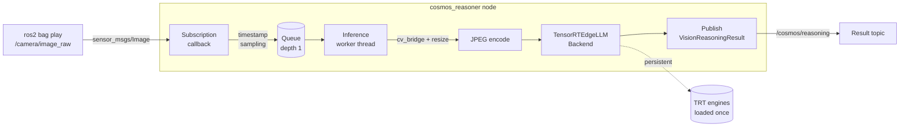

# cosmos_ros2_video_reasoner

ROS 2 Jazzy pipeline for **NVIDIA Jetson AGX Thor** that samples camera frames
from a ROS 2 bag or live camera, sends each frame to a persistent
[NVIDIA Cosmos Reason2](https://developer.nvidia.com/cosmos) TensorRT
Edge-LLM VLM engine, and publishes structured reasoning results.

---

## Architecture



---

## Platform support

| Component | Version |
|---|---|
| Hardware | NVIDIA Jetson AGX Thor |
| JetPack | 7.2 |
| ROS 2 | Jazzy |
| TensorRT Edge-LLM | 0.9.x / current main |
| Cosmos Reason2 model | 2B or 8B |
| Isaac ROS | 4.5 in Docker (optional; experimental on JetPack 7.2) |

---

## Prerequisites

### 1 — TensorRT Edge-LLM SDK

```bash
git clone https://github.com/NVIDIA/TensorRT-Edge-LLM.git ~/TensorRT-Edge-LLM
cd ~/TensorRT-Edge-LLM
git submodule update --init --recursive
# Build for Jetson AGX Thor using the same configuration used for the engines
mkdir -p build && cd build
cmake .. \\
  -DCMAKE_BUILD_TYPE=Release \\
  -DTRT_PACKAGE_DIR=/usr \\
  -DCMAKE_TOOLCHAIN_FILE=cmake/aarch64_linux_toolchain.cmake \\
  -DEMBEDDED_TARGET=jetson-thor \\
  -DCUDA_CTK_VERSION=13.0 \\
  -DENABLE_CUTE_DSL=ALL
make -j$(nproc)
```

The build produces:
* `build/libedgellmCore.a`
* `build/libNvInfer_edgellm_plugin.so`

### 2 — Cosmos Reason2 TensorRT engines

Follow the Cosmos Reason2 quantisation guide to produce engine directories:

```
~/tensorrt-edgellm-workspace/Cosmos-Reason2-2B/engine/llm/
~/tensorrt-edgellm-workspace/Cosmos-Reason2-2B/engine/
```

or the 8B variant.  The `engine/` directory must contain the visual encoder
engine; `engine/llm/` must contain the language model engine and tokenizer
files (`tokenizer.json`, `tokenizer_config.json`,
`processed_chat_template.json`).

---

## Build

```bash
mkdir -p ~/ros2_ws/src
cd ~/ros2_ws/src
git clone <repository-url> cosmos_ros2_video_reasoner

cd ~/ros2_ws
colcon build \
  --symlink-install \
  --cmake-args \
    -DTENSORRT_EDGE_LLM_ROOT=$HOME/TensorRT-Edge-LLM \
    -DTENSORRT_EDGE_LLM_BUILD_DIR=$HOME/TensorRT-Edge-LLM/build \
    -DTRT_PACKAGE_DIR=/path/to/tensorrt

source install/setup.bash
```

### Build without GPU (tests only)

Omit the `-DTENSORRT_EDGE_LLM_*` flags to build the node library and run
hardware-independent tests:

```bash
colcon build --symlink-install
colcon test --packages-select cosmos_ros2_video_reasoner
```

---

## Engine path configuration

Pass engine paths as launch arguments or in the YAML config:

```bash
ros2 launch cosmos_ros2_video_reasoner cosmos_reasoner.launch.py \
  llm_engine_dir:=/absolute/path/to/engine/llm \
  multimodal_engine_dir:=/absolute/path/to/engine \
  edge_llm_plugin_path:=/absolute/path/to/libNvInfer_edgellm_plugin.so
```

> **Note**: Paths must be absolute.  `~` is not expanded inside `rclcpp`.

---

## ROS bag playback

### Discover available topics

```bash
ros2 bag info /path/to/my.bag
ros2 topic list
ros2 topic type /camera/image_raw
```

### Terminal 1 — start the node

```bash
ros2 launch cosmos_ros2_video_reasoner cosmos_reasoner.launch.py \
  image_topic:=/actual/camera/topic \
  llm_engine_dir:=/absolute/path/engine/llm \
  multimodal_engine_dir:=/absolute/path/engine \
  edge_llm_plugin_path:=/absolute/path/libNvInfer_edgellm_plugin.so \
  use_sim_time:=true
```

### Terminal 2 — play the bag

```bash
ros2 bag play /path/to/my.bag --clock
```

### Topic remapping (alternative)

```bash
ros2 launch cosmos_ros2_video_reasoner cosmos_reasoner.launch.py \
  ... \
  --ros-args --remap /camera/image_raw:=/your/actual/topic
```

---

## Downloadable test rosbags

The test-data scripts download NVIDIA's official Isaac ROS 4.5 quickstart
assets from NGC. Downloads are version-selected at runtime, resumable, and
stored under the ignored `test_data/rosbags/` directory.

List or download datasets:

```bash
bash scripts/test_data/download_rosbags.sh list
bash scripts/test_data/download_rosbags.sh download image-proc
bash scripts/test_data/download_rosbags.sh download h264
# Or download both:
bash scripts/test_data/download_rosbags.sh all
```

| Dataset | Camera data | Use |
|---|---|---|
| `image-proc` | Raw RGB image and camera info | Direct end-to-end Cosmos test |
| `h264` | Dual H.264 `CompressedImage` streams | Isaac ROS decoder pipeline testing |

Inspect any downloaded or locally recorded ROS 2 bag:

```bash
bash scripts/test_data/inspect_rosbag.sh /path/to/bag
```

The inspector lists raw and compressed camera topics and prints suggested
launch and playback commands. The current reasoner consumes
`sensor_msgs/msg/Image` directly; the H.264 dataset requires
`isaac_ros_h264_decoder` before its output can be sent to the reasoner.

For a complete test using the directly compatible NVIDIA image-proc bag,
configure `scripts/cosmos_env.sh`, build the workspace, then run:

```bash
bash scripts/test_data/run_image_proc_test.sh
```

The runner downloads the bag when needed, starts the persistent Cosmos
reasoner, plays the bag with simulated time, and shuts the node down when
playback completes. Override the data location with `ROSBAG_DIR`.

## Example output

```
[INFO] [cosmos_reasoner]: Subscribed to /camera/image_raw
[INFO] [cosmos_reasoner]: Publishing results to /cosmos/reasoning
[INFO] [cosmos_reasoner]: [frame 1 | 1.243 s] The scene shows a busy urban
  intersection. A pedestrian wearing a red jacket is crossing the street.
  Two cars — a white sedan and a dark SUV — are stopped at a traffic light.
  The weather appears overcast. No hazards identified.
[INFO] [cosmos_reasoner]: [frame 2 | 1.187 s] ...
```

---

## Parameter reference

| Parameter | Type | Default | Description |
|---|---|---|---|
| `image_topic` | string | `/camera/image_raw` | Input image topic |
| `result_topic` | string | `/cosmos/reasoning` | Output result topic |
| `llm_engine_dir` | string | `""` | **Required** — absolute path to LLM engine dir |
| `multimodal_engine_dir` | string | `""` | **Required** — absolute path to visual encoder engine dir |
| `edge_llm_plugin_path` | string | `""` | Absolute path to plugin `.so` (or set `EDGELLM_PLUGIN_PATH`) |
| `prompt` | string | (scene description) | Text prompt sent for every frame |
| `sample_period_seconds` | double | `2.0` | Minimum seconds between sampled frames (message timestamp) |
| `max_generate_length` | int | `256` | Maximum tokens to generate |
| `temperature` | double | `0.2` | Sampling temperature |
| `top_p` | double | `0.9` | Nucleus sampling probability |
| `top_k` | int | `20` | Top-k sampling |
| `image_max_width` | int | `1280` | Resize if wider (aspect preserved) |
| `jpeg_quality` | int | `90` | JPEG quality for VLM ingestion |
| `drop_old_frames` | bool | `true` | Drop pending frame when worker busy |
| `publish_results` | bool | `true` | Publish result messages |
| `dump_profile` | bool | `false` | Enable Edge-LLM profiling |

---

## Troubleshooting

### Missing plugin: `Cannot open plugin library`

```
[ERROR] [cosmos_reasoner]: Failed to load TensorRT Edge-LLM plugin library.
```

* Verify `edge_llm_plugin_path` points to the built
  `libNvInfer_edgellm_plugin.so`.
* Or set `export EDGELLM_PLUGIN_PATH=/path/to/libNvInfer_edgellm_plugin.so`.
* Check `LD_LIBRARY_PATH` includes the TensorRT library directory.

### Incompatible engines: `Failed to deserialize engine`

Engines were built with a different TensorRT version.  Rebuild the Cosmos
engines against the TensorRT version installed with JetPack 7.2.

### CUDA initialisation failure

```
[ERROR] [cosmos_reasoner]: cudaStreamCreate failed
```

* Verify CUDA runtime is installed: `nvcc --version`.
* On Jetson, ensure `nvidia-container-toolkit` or direct GPU access is available.

### Image encoding failure: `cv::imencode failed`

* cv_bridge received a non-standard image encoding.  Check the bag's image
  encoding with `ros2 topic echo /camera/image_raw --once`.
* Supported encodings: `bgr8`, `rgb8`, `mono8`, `16uc1` (cv_bridge will
  convert).

### Wrong bag topic

```
[WARN] [cosmos_reasoner]: No messages received on /camera/image_raw
```

* Use `ros2 bag info` to find the correct topic name and pass it via
  `image_topic:=` or `--ros-args --remap`.

### Slow inference / high frame drop rate

Inference on 2B/8B models at full resolution may take 1–3 seconds per frame.
Increase `sample_period_seconds` to reduce load.  Ensure only one `cosmos_reasoner`
node is running (running two loads two copies of the engines into VRAM).

---

## Performance notes

**Why keep engines loaded?** Deserialising a Cosmos Reason2 TensorRT engine
takes 15–60 seconds.  Loading once at startup and reusing the runtime for all
frames reduces per-frame latency from minutes to seconds.

**Why a bounded queue?** The inference worker is single-threaded and
single-pass (no continuous batching).  Allowing an unbounded queue would
accumulate stale frames and grow memory without bound during a long bag
replay.  With `drop_old_frames = true` the queue remains at depth 1 and the
worker always sees the freshest available frame.

---

## Known limitations

* **Sampled images, not video**: The ROS node currently processes independent sampled frames; its Edge-LLM integration does not yet expose native
  video-stream input.  Frames are treated as independent images.
* **CompressedImage support**: Follow-up task — subscribe to
  `sensor_msgs/msg/CompressedImage` via `image_transport` to avoid
  intermediate decoding when the source is a compressed bag.
* **Batch size 1**: Single-request inference only; no batching across frames.

---

## License

Apache 2.0 — see [LICENSE](LICENSE).


---

## Automated Thor deployment setup

The setup scripts target Jetson AGX Thor with JetPack 7.2 / Jetson Linux R39.2
and Ubuntu 24.04. They install the full JetPack development stack, ROS 2 Jazzy,
OpenCV, rosbag2, rosdep, colcon, and the packages needed to compile this node.

From the repository root:

```bash
bash scripts/setup_deployment.sh
```

On the first run, the script installs system dependencies and creates a local
configuration file:

```text
scripts/cosmos_env.sh
```

Review the model and engine paths in that file, then finish deployment:

```bash
bash scripts/build_workspace.sh
bash scripts/verify_deployment.sh
```

To install RViz and the complete ROS desktop environment as well:

```bash
bash scripts/install_dependencies.sh --desktop
```

### Optional Isaac ROS environment

NVIDIA Isaac ROS 4.5 uses ROS 2 Jazzy and supports Jetson AGX Thor, but its
current tested platform matrix specifies JetPack 7.1 / Jetson Linux R38.4.
This repository targets JetPack 7.2 / R39.2 for TensorRT Edge-LLM, so that
exact combined configuration is not yet officially validated by NVIDIA.

Configure Isaac ROS in NVIDIA's recommended Docker isolation mode:

```bash
bash scripts/install_dependencies.sh --isaac-ros
```

This adds NVIDIA's pinned `release-4.5 noble-jetpack` repository, installs
`isaac-ros-cli` and the NVIDIA container toolkit, and initializes the CLI in
Docker mode. It deliberately does not install Isaac ROS bare-metal or replace
the host CUDA, TensorRT, or OpenCV packages.

Log out and back in to refresh Docker group membership, then verify:

```bash
bash scripts/verify_deployment.sh --isaac-ros
docker info | grep -E "Runtimes|Default Runtime"
```

The verifier treats missing Isaac ROS tooling as a failure but reports the
JetPack 7.2 support-matrix gap as a warning. See NVIDIA's
[Isaac ROS system requirements and setup](https://nvidia-isaac-ros.github.io/getting_started/index.html).

The default is the smaller `ros-jazzy-ros-base` deployment. The installer
refuses to continue on an unexpected OS, CPU architecture, or Jetson Linux
release unless `--force` is supplied.

The scripts intentionally do not rebuild TensorRT Edge-LLM or the Cosmos
engines. Those artifacts are hardware-specific and must already have been
built on this Thor. `verify_deployment.sh` checks that the source tree, core
archive, plugin, language engine, visual engine, ROS overlay, and installed
node are all present.
