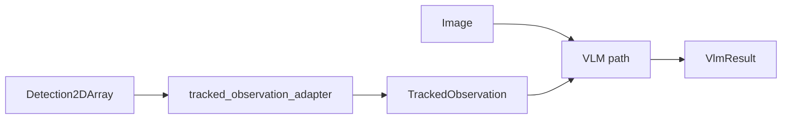
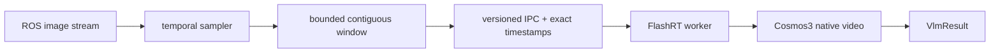

# Architecture

## Purpose

`edge_vlm_ros` is a generic ROS 2 VLM pipeline for connecting image streams and optional structured perception context to persistent accelerator-backed model runtimes.

The validated Jetson AGX Thor path uses separate ROS and GPU-runtime processes. That process boundary is a correctness requirement for the tested TensorRT Edge-LLM stack, not merely a deployment preference.

## Documentation map

This document is the source of truth for the currently deployed ROS/IPC runtime architecture. Broader temporal and evaluation design is documented separately:

- [Architecture design map](architecture/README.md)
- [Temporal VLM architecture](architecture/temporal-vlm-architecture.md)
- [Temporal evidence/results matrix](architecture/temporal-results-matrix.md)
- [Controlled chronology results](temporal-chronology-results.md)
- [Temporal task-distillation pipeline](distillation-pipeline-design.md)
- [Architecture decision records](adr/README.md)

## Standard process architecture

```mermaid
flowchart LR
    CAMERA[ROS image source] --> NODE[edge_vlm_ros_node]
    NODE -->|versioned BGR8 IPC| SOCK[(Unix socket)]
    SOCK --> WORKER[edge_vlm_server]
    WORKER --> RUNTIME[TensorRT Edge-LLM / model engine]
    RUNTIME --> WORKER
    WORKER --> SOCK
    NODE --> RESULT[/vlm/result]
```

### ROS process responsibilities

The ROS process owns:

- subscription to the configured image topic;
- frame sampling and latest-only scheduling;
- optional tracked-observation input;
- request construction and IPC transport;
- result publication;
- ROS timestamps and topic provenance;
- watchdog/reconnect behavior when the inference worker restarts.

It intentionally does not load the TensorRT/CUDA model runtime on the validated Edge-LLM path.

### Inference worker responsibilities

The worker owns:

- model and engine initialization;
- image preprocessing;
- prompt/history application;
- model inference;
- response serialization;
- runtime-specific temporal encoding when the selected backend supports it.

The worker can remain loaded while ROS adapters or command-line experiment clients connect sequentially to the same socket contract.

## Why the process boundary exists

On Thor, loading ROS 2 transitive native libraries into the same process as TensorRT Edge-LLM produced a reproducible fused-attention prefill stall. Separating the runtimes removes that interaction and also provides operational benefits:

- worker crashes do not require restarting the ROS graph;
- model startup cost can be amortized across client reconnects;
- ROS can remain model/runtime neutral;
- standalone experiments can reuse the same inference service.

See [thor-edge-llm-prefill-stall-rca.md](thor-edge-llm-prefill-stall-rca.md) for the investigation.

## IPC contract

The versioned Unix-socket protocol carries:

- one or more packed BGR8 frames;
- image dimensions and stride;
- sequence type;
- optional exact frame timestamps;
- optional FPS metadata;
- prompt text;
- optional system/history context;
- generation configuration;
- result text, errors, inference timing, and runtime temporal-encoding provenance.

The transport is intentionally independent of a specific VLM so alternate workers can implement the same contract.

## Scheduling and backpressure

VLM inference is slower than typical camera publication rates. The live pipeline therefore treats inference as an observation service, not a frame-by-frame codec.

The default scheduling policy is latest-only:

1. sample frames at a configurable interval;
2. allow at most one active inference request;
3. while inference is busy, retain only the newest pending observation/window;
4. submit that newest pending input when the worker becomes available.

This prevents an unbounded inference queue and keeps output tied to recent sensor evidence.

## Optional tracked-observation path

A detector/tracker adapter can provide structured object context independently of the VLM runtime.



The detector is replaceable as long as it publishes the expected ROS message contract. This keeps perception components independently testable and avoids hard-coding one detector into the VLM node.

## Temporal/native-video path

The `flashrt_temporal/` experiment extends the same design with a bounded rolling frame window and native Cosmos3 video preprocessing.



Key invariants:

- frame order is explicit;
- exact capture timestamps are preserved;
- large forward gaps reset the temporal window;
- backward timestamps reset the temporal window;
- a discontinuous source is never silently presented as one continuous video;
- runtime temporal encoding is recorded in result provenance.

The rolling-window scheduler remains outside the model runtime so sampling/backpressure policy can evolve independently of model preprocessing.

## Representation is part of the experiment

Ordered still images and native video are not interchangeable labels for the same input. They can exercise different processor/runtime paths and carry different timing semantics.

Any benchmark or training sample that claims temporal behavior should record at least:

- frame order;
- frame timestamps or explicit resampling policy;
- sequence type;
- runtime temporal encoding;
- model/engine identity;
- prompt version;
- output-token limit.

See the temporal architecture and results matrix for the corresponding design rules and evidence.

## Fault handling

The ROS side treats worker failures as recoverable transport/runtime events:

- socket errors close the client connection;
- subsequent requests reconnect;
- launch can respawn the worker independently;
- bounded request deadlines prevent indefinite hangs;
- ROS shutdown avoids publishing after context teardown.

## Output contract

`edge_vlm_ros/msg/VlmResult` is the common result surface. It carries generated text plus source, prompt, timing, sequence, and optional tracker provenance so downstream tools can compare model behavior without depending on one runtime implementation.

## Design principle

The repository keeps four concerns separate:

```text
ROS acquisition/scheduling
        ->
representation + IPC
        ->
model/runtime adapter
        ->
normalized result/evaluation
```

That separation is the central architectural goal of the demo: models, temporal representations, and upstream perception components can be compared without rewriting the ROS-facing pipeline.
